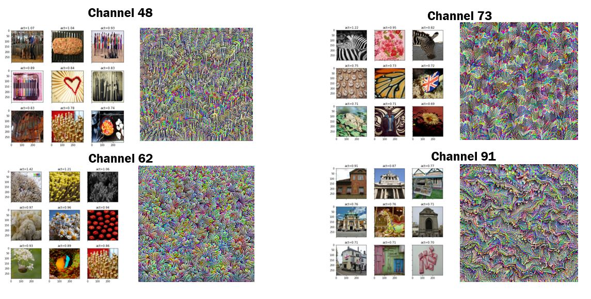
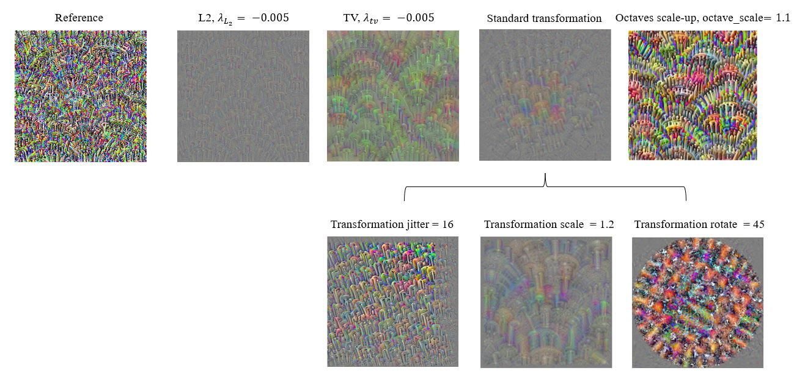

# Feature visualisation of CNN

## **Motivation**
As is well known, Convolutional Neural Network (CNN) has been widely used in computer vision field to solve many complex tasks, such as image classification, objects detection and so on. AS the inner work of CNN becomes more and more opaque, there is a growing sense that networks need to be interpretable for human. Various research has been conducted to explain the inner workings of pre-trained CNNs via visualisation techniques and feature visualisation is one of the most powerful tool to make neural networks more interpretable and less opaque. However, getting it actually to work involves vast details, because optimising an image from scratch alone often contains a mass of meaningless noise. The fact is that if we cannot interpret the images, it will limit our understanding of the features detected by the network. Therefore, regarding the technique, one of the primary challenges is how to improve it to obtain more interpretable resultant visualisations, which can be accomplished by incorporating regularisations into the AM.

## **Overview**
This project aims to implement feature visualisation for channels of CNN via Activation Maximisation (AM) in order to shed light into channels’ behaviours and then explore and analyse several regularisation methods to improve AM. Concretely, the main achievemnets are 
- feature visualisation was successfully implemented via Activation Maximization (AM) channel-wise to synthesise an image to indicate what a certain channel is doing.
- several existing regularisation methods that are commonly used in optimisation-based visualisations were reviewed and applied on AM to investigate their impact on the optimised images
- an evaluation strategy was proposed and the effect of different regularisations along with their corresponding parameters were quantitatively evaluated.  

## **Methodology**
During implementation phase, the deepdream was recreated on a pretrained CNN in TensorFlow 2 to determine which layer is suitable to start exploring its channels; and then base AM was implemented on channels of the chosen layer (**mixed6**), see the visualistion result generated by the base AM running on **channel 0**. 

Besides, the proposed evaluation method was implemented. Firstly, I selected a suitable dataset (**ImageNet-v2**) and then this dataset was used to generate 9 images that maximumly activate the target channel. This method is also called **top-9 dataset samples**, which is commonly used to qualitatively evaluate the AM images (see file `top9-v-0-119` for the top-9 dataset samples of first 120 channels). Lastly, the top-9 sets and a perceptual metrics called **LPIPS** were used to calculate the “interpretability” of the AM images. 

So How did I define the “interpretability” in this project? Concretely, I will take **channel 62** as an example (as shown in the figure below), that means I’ve paired each of the images from top-9 with the generated AM image and the pass each pair to LPIPS model, and it will output the perceptual similarity between the two images. So eventually, I will get 9 similarities for each channel, and then the average of those 9 values is taken as the final result to indicate the "interpretability" in this project. The lower value mean the AM image looks closer to the real images. 

Several representative channels were manually selected from the first 120 channels for the following experiments. Here are the 4 selected channels.

During the experiment phase, aforementioned 4 regularisations were incorporated with the base AM and then they were applied to the selected channels separately. For each regularisation, a range of values was tested to estimate the optimal value for, see the best results below generated by channel 48 in each experiment (evaluated by the LPIPS values). We can see from those images that different regularisations can impact the AM images from different aspects. 

## **How to use**
### Run on Google Colab
- Download the `.ipynb` file
- Choose GPU as your hardware accelerator
- Follow the instructions in the script and run the code

## Code References
1. C. Olah, A. Mordvintsev and L. Schubert, “Feature Visualization,” Distill, 2017. 
2. “Google Colaboratory: DeepDream,” 4 12 2020. [Online]. Available: https://colab.research.google.com/github/tensorflow/docs/blob/master/site/en/tutorials/generative/deepdream.ipynb.
3. F.-F. Li, J. Deng, O. Russakovsky, A. Berg and K. Li, “ImageNet,” Stanford University, [Online]. Available: http://www.image-net.org/download-images.
4. R. Zhang, P. Isola, A. A. Efros, E. Shechtman and O. Wang, “The Unreasonable Effectiveness of Deep Features as a Perceptual Metric,” arXiv:1801.03924 [cs], 2018. Available: https://github.com/S-aiueo32/lpips-pytorch
